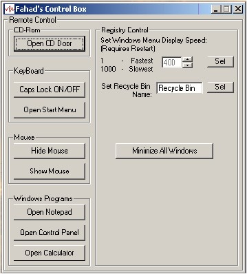



## API functions, all packed in one\!

### Description

Ever wanted to learn cool API functions to do some neat stuff?

Well here it is folks.. all packed on one. Learn how to hide/show

mouse cursors, fool around with the registry, rename recycle-bin,

change the menu speed of windows, open/close cd-rom.. and call other

system commands. Gives you a good jump start on API calls with this neat

example! Check it out and please vote for it.. Thanks!
 
### More Info
 

             |
---                |---
**Submitted On**   |2001-01-09 07:03:14
**By**             |[Syed Fahad Gilani](https://github.com/Planet-Source-Code/PSCIndex/blob/master/ByAuthor/syed-fahad-gilani.md)
**Level**          |Advanced
**User Rating**    |4.4 (35 globes from 8 users)
**Compatibility**  |VB 4\.0 \(32\-bit\), VB 5\.0, VB 6\.0
**Category**       |[Complete Applications](https://github.com/Planet-Source-Code/PSCIndex/blob/master/ByCategory/complete-applications__1-27.md)
**World**          |[Visual Basic](https://github.com/Planet-Source-Code/PSCIndex/blob/master/ByWorld/visual-basic.md)
**Archive File**   |[CODE\_UPLOAD13564182001\.zip](https://github.com/Planet-Source-Code/syed-fahad-gilani-api-functions-all-packed-in-one__1-14267/archive/master.zip)

